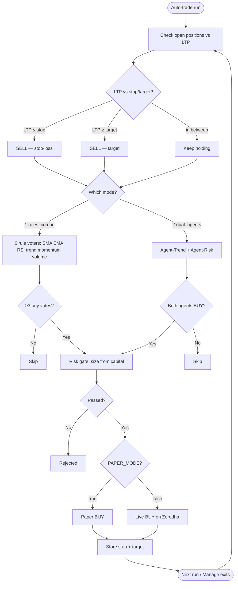
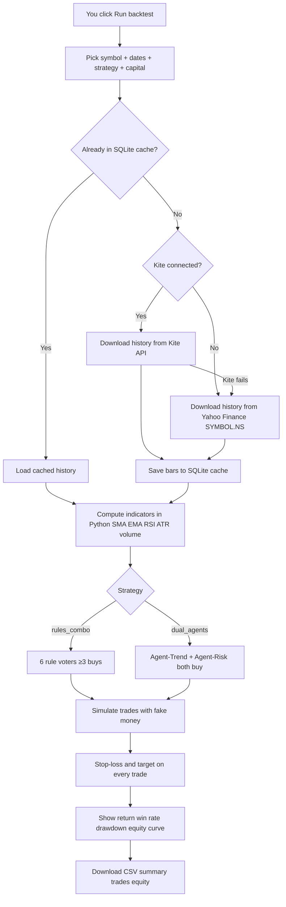

# NSE Cash-Equity Bot

Personal research bot for **NSE cash stocks** (not F&O): picks a few names with rules + AI, backtests strategies, and connects to Zerodha Kite for data.

**Right now it does not place live trades.** `PAPER_MODE=true` by default. That is intentional.

This is not investment advice.

---

## How this works (short)

```text
NSE Top 200 stocks
        ↓
4 rule strategies vote (SMA / EMA / RSI / trend quality)
        ↓
2 AI agents (Agent-Trend + Agent-Risk) must both agree
        ↓
Risk gate (stop mandatory, size from your capital, daily loss limit)
        ↓
PAPER orders by default  →  live only if PAPER_MODE=false
```

### How decisions are made (flowchart)

Only **two** modes. Buy stores stop + target; sell happens later when price hits those levels.



### Strategies (only two)

| Key | What it does |
| --- | --- |
| `rules_combo` | **1** — 6 rule voters combined (SMA, EMA, RSI, trend, momentum, volume). Need ≥3 buys. |
| `dual_agents` | **2** — Agent-Trend + Agent-Risk must both say buy. |

Legacy names (`ensemble`, `combined`, `sma_ai`, …) still map to one of these two.

### Daily auto-trade (paper)

```bash
python -m trading_bot auto-trade --strategy rules_combo --capital 100000
python -m trading_bot auto-trade --strategy dual_agents --capital 100000
```

Nothing guarantees daily profits — paper first, then live only with proper algo registration.  
Keeps `PAPER_MODE=true` unless you deliberately set it false.

---

| Mode | What happens |
| --- | --- |
| **Backtest** | Fake money + historical prices (Kite if connected, else Yahoo) → trade list + P&L |
| **Auto-trade + PAPER_MODE=true** | Real prices for decisions; **paper** fills (no real money) |
| **Auto-trade + PAPER_MODE=false** | Real Zerodha orders with real capital |

---

## User guide

### 1. Start the app (local)

```bash
cd d:\NOT_BACKTEST
.venv\Scripts\activate
python -m trading_bot dashboard
```

Browser opens at `http://127.0.0.1:8501/`.

**First time only**

1. Tab **Setup & Kite** → paste OpenAI key + Kite API key + secret → **Save keys**
2. Click **Connect Kite** → log in on Zerodha → you return to the dashboard connected  
3. Do this again each trading day (Kite token expires ~6 AM IST)

### 2. Start the app (Streamlit Cloud)

1. Deploy from GitHub (`app.py` as main file) — see [Streamlit Cloud](#streamlit-community-cloud-deploy)
2. Put keys in **Streamlit Secrets** (not in GitHub)
3. Set Kite **Redirect URL** to your `https://….streamlit.app/` URL
4. Open the app → **Connect Kite**

### 3. How to run a backtest

**In the dashboard (easiest)**

1. Open tab **Backtest**
2. Pick a stock (from Top 200)
3. Pick a strategy:
   - `rules_combo` — 6 rule voters (≥3 must buy)  
   - `dual_agents` — Agent-Trend + Agent-Risk must both buy  
4. Choose start date, end date, capital (₹)
5. Leave “Use live OpenAI…” **off** unless you want a slow/expensive dual-agents run  
6. Click **Run backtest**
7. Under **Download CSV**, save Summary / Trades / Equity curve to your PC

You’ll get return %, win rate, max drawdown, equity curve, and commentary.

**From the command line**

```bash
python -m trading_bot backtest --symbol RELIANCE --strategy rules_combo --start 2024-01-01 --end 2025-12-31 --capital 100000
```

Same run twice = instant (results cached in SQLite).

Streamlit Cloud cannot push CSVs to GitHub. Use the download buttons. Locally, exports also land in `data/exports/backtests/` (gitignored).

### How backtest works (flowchart)

Fake money + **real historical prices** → simulated buys/sells → profit/loss report.  
No real orders. No Kite account reports. No live money movement.



#### Without Kite connected

```text
Run backtest → need prices → Yahoo Finance → indicators → fake trades → P&L / CSV
```

- Works without login  
- Uses Yahoo’s NSE history (`RELIANCE.NS`, etc.)  
- Still **real past prices**, not made-up numbers  
- No live quotes tab  

#### With Kite connected

```text
Connect Kite → Run backtest → need prices → Kite historical API → (fallback Yahoo) → fake trades → P&L / CSV
```

- Prefers **Zerodha Kite daily history**  
- If Kite fails or misses data → falls back to Yahoo  
- Same simulation (fake money) — **not** your cash, **not** Kite reports/portfolio  

| | Kite **not** connected | Kite **connected** |
| --- | --- | --- |
| Backtest price source | Yahoo | Kite first, then Yahoo |
| Live quotes | No | Yes |
| Real money orders | No | No |
| Uses your Kite P&L reports | No | No |

### 4. Daily stock selection

**Dashboard:** tab **Daily selection** → pick date → optional manual symbol → **Run selection**.

**CLI:**

```bash
python -m trading_bot select --date 2026-08-14
python -m trading_bot select --manual INFY
```

Rules:

- 3–4 stocks total  
- At least 3 from NSE Top 100 when enough buys exist  
- At most 1 stock priced below ₹50  
- Manual adds are tagged `manual` (separate from `ai_selected`)

### 5. Live quotes

Tab **Live quotes** after Kite is connected. Quotes only — **no orders**.

### 6. When does it start trading?

| Stage | Places orders? | How you turn it on |
| --- | --- | --- |
| **Now (Phase 2)** | **No** | App starts; you backtest and select stocks only |
| Phase 3 | No | Risk gate built and unit-tested |
| Phase 4 | Simulated only | Paper mode with live prices for weeks |
| Phase 5–6 | Real money | You manually set `PAPER_MODE=false` **and** Zerodha/SEBI algo registration is done |

**Starting the app does not start trading.**  
There is no auto-buy when you open the dashboard or Streamlit Cloud.

Live orders will only happen later if:

1. Risk module is finished  
2. Paper results look sane vs backtests  
3. You explicitly set `PAPER_MODE=false` (never the default)  
4. Your algo is registered with Zerodha under the SEBI framework  

Until then: research, backtests, selection, quotes only.

---

## What each dashboard tab does

| Tab | Purpose |
| --- | --- |
| **Setup & Kite** | Keys, Kite login, Cloud redirect URL help |
| **Backtest** | Simulate a strategy on one stock’s history |
| **Daily selection** | Today’s 3–4 AI/rule picks + optional manual add |
| **Live quotes** | Last traded price from Kite |

---

## First-time setup (local)

Python 3.11+ recommended.

```bash
cd d:\NOT_BACKTEST
python -m venv .venv
.venv\Scripts\activate
pip install -e ".[dev]"
copy .env.example .env
python -m trading_bot init-db
python -m trading_bot dashboard
```

`.env` (or dashboard Setup tab):

- `PAPER_MODE=true` — leave this  
- `OPENAI_API_KEY`  
- `KITE_API_KEY` / `KITE_API_SECRET`  
- `KITE_ACCESS_TOKEN` — filled after Connect Kite  
- `KITE_REDIRECT_URL=http://127.0.0.1:8501/` for local  

Never commit `.env`. See [SECURITY.md](SECURITY.md).

---

## Kite Connect app form

| Field | Local | Streamlit Cloud |
| --- | --- | --- |
| **Type** | **Connect** (not Personal) | same |
| **App name** | `sam_bot` | same |
| **Client ID** | `AR5852` | same |
| **Redirect URL** | `http://127.0.0.1:8501/` | `https://YOUR-APP.streamlit.app/` |
| **Postback URL** | empty | empty |

Erase the form’s locked `https://` when using local HTTP. Cloud must use real HTTPS.

---

## Streamlit Community Cloud deploy

1. [share.streamlit.io](https://share.streamlit.io) → **New app**  
2. Repo `shaikssam65/NOT_BACKTEST` · branch `master` · main file **`app.py`**  
3. Secrets:

```toml
PAPER_MODE = "true"
OPENAI_API_KEY = "sk-..."
OPENAI_MODEL = "gpt-4o"
KITE_API_KEY = "..."
KITE_API_SECRET = "..."
KITE_REDIRECT_URL = "https://YOUR-APP-NAME.streamlit.app/"
```

4. Deploy → copy live URL  
5. Kite app Redirect URL = that URL (trailing `/`)  
6. Match `KITE_REDIRECT_URL` in Secrets → reboot → **Connect Kite**

---

## Build status

| Module | Status |
| --- | --- |
| Universe + daily selection | Done |
| AI decision layer | Done |
| Backtest + cache | Done |
| Streamlit dashboard | Done |
| Risk gate `validate_order()` | Phase 3 — next |
| Paper / live orders | Phase 4+ — not built |

---

## Extra commands

```bash
python -m trading_bot init-db
python -m trading_bot refresh-universe
python -m trading_bot select --date 2026-08-14
python -m trading_bot backtest --symbol RELIANCE --strategy combined --start 2024-01-01 --end 2025-12-31 --capital 100000
python -m trading_bot serve          # FastAPI on :8000
python -m trading_bot dashboard      # Streamlit on :8501
pytest
```

---

## Backtest details (short)

- Indicators computed in Python (LLM does not do the math)  
- Signal at day *t* close → enter day *t+1* open  
- Stop-loss required on every simulated trade  
- Strategies: `rule_based` · `ai_filtered` · `combined`  
- Risk knobs live in `config/settings.yaml`  

---

## Roadmap (do not skip)

3. Risk gate + unit tests (every order, including manual)  
4. Paper trading for several weeks  
5. Confirm SEBI / Zerodha algo registration  
6. Live with a small capital fraction only after paper matches backtests  
